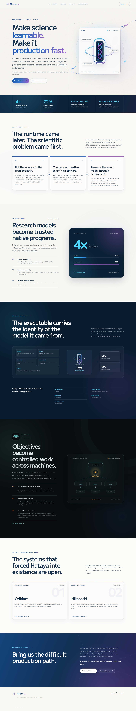
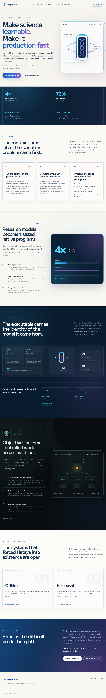

# Rendered previews

These files are regenerated by `npm run visual:check` and committed so the current site can be inspected without starting a development server.

Adding Kaname made the complete page taller than some PNG preview renderers allow. The full-page files remain useful for automated checks, but can appear cut off in an inline viewer.

Use the continuous scroll tiles to inspect the page in order without losing transitions. Adjacent tiles overlap by 160 px. Use the sectional renders when you need one section at full resolution.

## Continuous desktop scroll, 1440 px wide

1. [Top](desktop-scroll/01.png)
2. [Middle](desktop-scroll/02.png)
3. [Bottom](desktop-scroll/03.png)

## Continuous mobile scroll, 390 px wide

1. [Top](mobile-scroll/01.png)
2. [Upper middle](mobile-scroll/02.png)
3. [Lower middle](mobile-scroll/03.png)
4. [Bottom](mobile-scroll/04.png)

## Desktop sections, 1440 px wide

1. [Hero](desktop-sections/01-hero.png)
2. [Proof strip](desktop-sections/02-proof.png)
3. [Origin](desktop-sections/03-origin.png)
4. [Hataya](desktop-sections/04-hataya.png)
5. [Model identity](desktop-sections/05-provenance.png)
6. [Kaname](desktop-sections/06-kaname.png)
7. [Open source](desktop-sections/07-open-source.png)
8. [Contact](desktop-sections/08-contact.png)
9. [Footer](desktop-sections/09-footer.png)

## Mobile sections, 390 px wide

1. [Hero](mobile-sections/01-hero.png)
2. [Proof strip](mobile-sections/02-proof.png)
3. [Origin](mobile-sections/03-origin.png)
4. [Hataya](mobile-sections/04-hataya.png)
5. [Model identity](mobile-sections/05-provenance.png)
6. [Kaname](mobile-sections/06-kaname.png)
7. [Open source](mobile-sections/07-open-source.png)
8. [Contact](mobile-sections/08-contact.png)
9. [Footer](mobile-sections/09-footer.png)

## Full-page diagnostic captures

### Desktop, 1440 × 1000 viewport

### Laptop, 1024 × 768 viewport

### Mobile, 390 × 844 viewport

### Small mobile, 320 × 700 viewport

